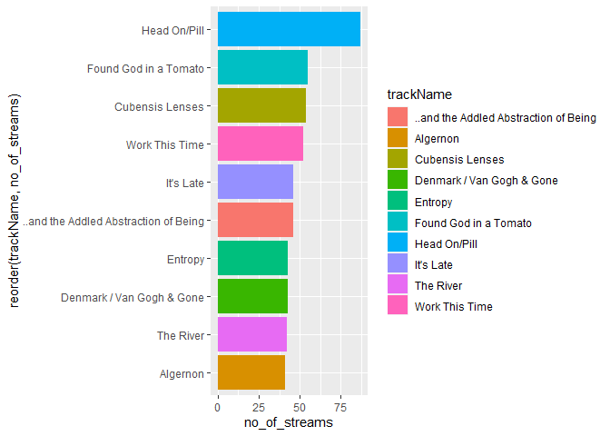
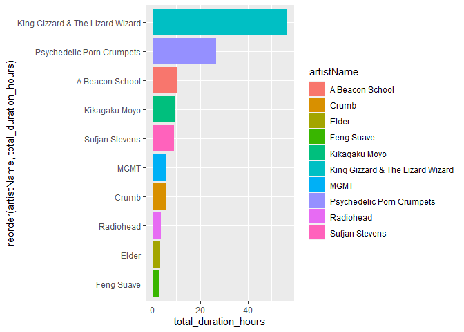
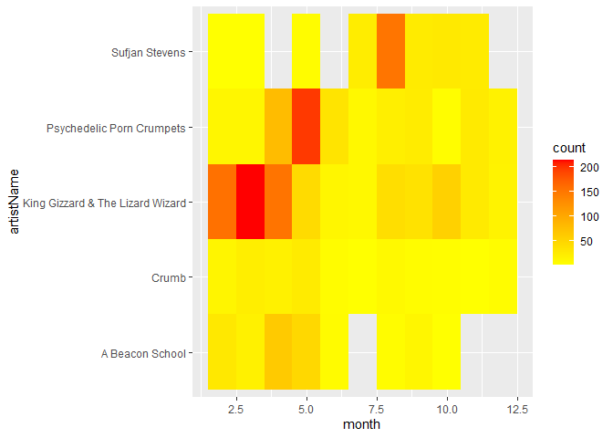
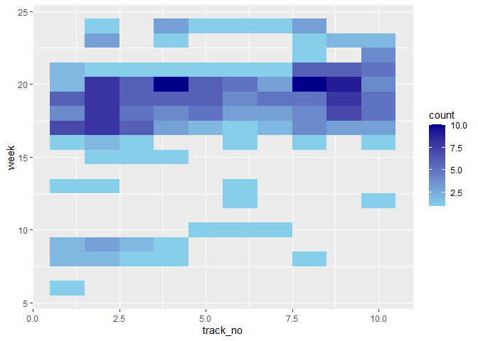
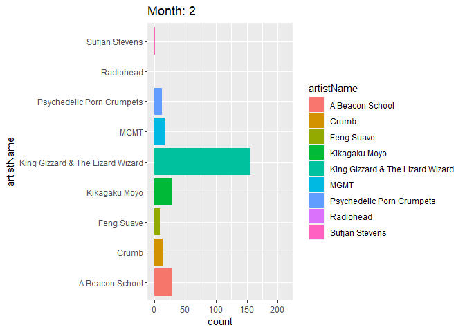
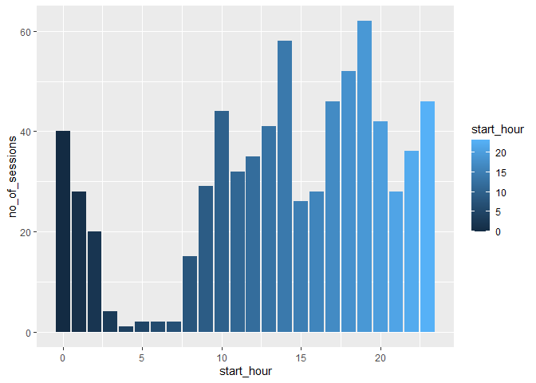

Spotify Analysis
================
Kevin
20 February 2021

## Spotify Data

| endTime             | artistName                       | trackName      | msPlayed | albumName                | duration\_ms | popularity | track\_no | tracks\_in\_album | album\_release\_date | completed | year | month | day | week | date       | wday | hour | minute | streamID | session\_id |
| :------------------ | :------------------------------- | :------------- | -------: | :----------------------- | -----------: | ---------: | --------: | ----------------: | :------------------- | --------: | ---: | ----: | --: | ---: | :--------- | ---: | ---: | -----: | -------: | ----------: |
| 2020-02-03 20:04:00 | King Gizzard & The Lizard Wizard | Searching…     |    30820 | Polygondwanaland         |       183546 |         24 |         9 |                10 | 2017-11-18           |         0 | 2020 |     2 |   3 |    5 | 2020-02-03 |    2 |   20 |      4 |        1 |           1 |
| 2020-02-04 08:56:00 | King Gizzard & The Lizard Wizard | The River      |   541723 | Quarters\!               |       610253 |         33 |         1 |                 5 | 2015-05-01           |         0 | 2020 |     2 |   4 |    5 | 2020-02-04 |    3 |    8 |     56 |        2 |           2 |
| 2020-02-04 09:01:00 | King Gizzard & The Lizard Wizard | Rattlesnake    |   128708 | Flying Microtonal Banana |       468093 |         39 |         1 |                 9 | 2017-02-24           |         0 | 2020 |     2 |   4 |    5 | 2020-02-04 |    3 |    9 |      1 |        3 |           2 |
| 2020-02-04 09:04:00 | King Gizzard & The Lizard Wizard | Melting        |    71099 | Flying Microtonal Banana |       327333 |         30 |         2 |                 9 | 2017-02-24           |         0 | 2020 |     2 |   4 |    5 | 2020-02-04 |    3 |    9 |      4 |        4 |           2 |
| 2020-02-04 09:09:00 | King Gizzard & The Lizard Wizard | Sleep Drifter  |   269072 | Flying Microtonal Banana |       284853 |         34 |         4 |                 9 | 2017-02-24           |         0 | 2020 |     2 |   4 |    5 | 2020-02-04 |    3 |    9 |      9 |        5 |           2 |
| 2020-02-04 09:35:00 | King Gizzard & The Lizard Wizard | Nuclear Fusion |   224722 | Flying Microtonal Banana |       255453 |         37 |         8 |                 9 | 2017-02-24           |         0 | 2020 |     2 |   4 |    5 | 2020-02-04 |    3 |    9 |     35 |        6 |           3 |

## Most listened to songs

| artistName                       | trackName                             | no\_of\_streams | total\_minutes | no\_of\_completed\_streams |
| :------------------------------- | :------------------------------------ | --------------: | -------------: | -------------------------: |
| King Gizzard & The Lizard Wizard | Head On/Pill                          |              87 |       910.2902 |                         20 |
| Psychedelic Porn Crumpets        | Found God in a Tomato                 |              55 |       379.8565 |                         27 |
| Psychedelic Porn Crumpets        | Cubensis Lenses                       |              54 |       226.3214 |                         27 |
| King Gizzard & The Lizard Wizard | Work This Time                        |              52 |       213.6771 |                         32 |
| A Beacon School                  | It’s Late                             |              46 |       243.4486 |                         31 |
| Psychedelic Porn Crumpets        | ..and the Addled Abstraction of Being |              46 |       191.1777 |                         17 |
| Psychedelic Porn Crumpets        | Denmark / Van Gogh & Gone             |              43 |       193.9699 |                         14 |
| Psychedelic Porn Crumpets        | Entropy                               |              43 |        62.7783 |                         25 |
| King Gizzard & The Lizard Wizard | The River                             |              42 |       294.8719 |                         13 |
| A Beacon School                  | Algernon                              |              41 |       164.4458 |                         34 |

### By number of streams

<!-- -->

## Most listened to Artists

| artistName                       | songs\_played | distinct\_songs | distinct\_albums | total\_duration\_hours | completed\_songs |
| :------------------------------- | ------------: | --------------: | ---------------: | ---------------------: | ---------------: |
| King Gizzard & The Lizard Wizard |           797 |              88 |               15 |              56.594945 |              365 |
| Psychedelic Porn Crumpets        |           451 |              35 |                5 |              26.671862 |              239 |
| A Beacon School                  |           184 |              11 |                1 |              10.106069 |              126 |
| Kikagaku Moyo                    |           147 |              18 |                5 |               9.771851 |               85 |
| Sufjan Stevens                   |           257 |              39 |               10 |               9.157807 |              209 |
| MGMT                             |            99 |              21 |                6 |               5.897724 |               37 |
| Crumb                            |           104 |              14 |                3 |               5.468710 |               71 |
| Radiohead                        |            63 |              25 |                5 |               3.488848 |               35 |
| Elder                            |            27 |               8 |                3 |               3.143431 |               13 |
| Feng Suave                       |            54 |               6 |                5 |               2.996721 |               27 |

### By total duration

<!-- -->

## Most listened to album

| artistName                       | albumName                     | no\_of\_songs\_played | total\_duration\_hours | completed\_songs |
| :------------------------------- | :---------------------------- | --------------------: | ---------------------: | ---------------: |
| Psychedelic Porn Crumpets        | High Visceral, Pt. 1          |                   373 |              23.765413 |              206 |
| King Gizzard & The Lizard Wizard | Float Along - Fill Your Lungs |                   265 |              24.247995 |              123 |
| Sufjan Stevens                   | Aporia                        |                   203 |               6.504794 |              183 |
| A Beacon School                  | Cola                          |                   184 |              10.106069 |              126 |
| King Gizzard & The Lizard Wizard | Polygondwanaland              |                   149 |               9.898307 |               93 |
| Kikagaku Moyo                    | Forest of Lost Children       |                   114 |               8.125161 |               68 |
| King Gizzard & The Lizard Wizard | Quarters\!                    |                   103 |              10.083865 |               31 |
| King Gizzard & The Lizard Wizard | I’m In Your Mind Fuzz         |                    88 |               3.749603 |               35 |
| King Gizzard & The Lizard Wizard | Oddments                      |                    74 |               3.744620 |               39 |
| Mort Garson                      | Mother Earth’s Plantasia      |                    59 |               2.594090 |                2 |

### By Total duration

<!-- -->

## Story of High Visceral Album

<!-- -->

It was a different album which i didn’t like immediately, but after some
weeks it grew on me. Initially, I liked the louder first half of the
album, but later I started liking the mellower latter half of the album.
Eventually, I moved on to some other album.

## My favorite artists through the months

<!-- -->

The shifting between artists is visible. There were quite a few KGATLW
albums that I liked which kept me glued to their stuff till May till I
got into PPC’s High Visceral. There was one month there where I was
really into Sufjan Steven’s ambient album Aporia, a departure from my
regular genres. After that, I wasn’t into music a lot.

## Listening Sessions

| session\_id | no\_of\_songs | total\_runtime | start\_hour |
| ----------: | ------------: | -------------: | ----------: |
|           1 |             1 |         30.820 |          20 |
|           2 |             4 |       1010.602 |           8 |
|           3 |             1 |        224.722 |           9 |
|           4 |            16 |       3290.885 |          19 |
|           5 |            12 |       2862.474 |           8 |
|           6 |            21 |       3608.355 |          19 |

There are about 720 listening sessions in about 1 year, so close to 2
sessions a day on average

## When do I listen most during the day?

<!-- -->
