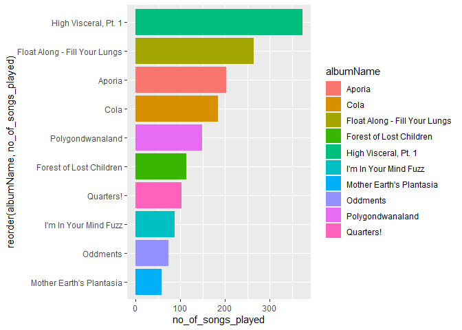

Spotify Analysis
================
Kevin
20 February 2021

## Importing data with correct data types

    ## Warning: 149 failed to parse.

    ##               endTime                       artistName      trackName
    ## 1 2020-02-03 14:34:00 King Gizzard & The Lizard Wizard   Searching...
    ## 2 2020-02-04 03:26:00 King Gizzard & The Lizard Wizard      The River
    ## 3 2020-02-04 03:31:00 King Gizzard & The Lizard Wizard    Rattlesnake
    ## 4 2020-02-04 03:34:00 King Gizzard & The Lizard Wizard        Melting
    ## 5 2020-02-04 03:39:00 King Gizzard & The Lizard Wizard  Sleep Drifter
    ## 6 2020-02-04 04:05:00 King Gizzard & The Lizard Wizard Nuclear Fusion
    ##   msPlayed                albumName duration_ms popularity track_no
    ## 1    30820         Polygondwanaland      183546         23        9
    ## 2   541723                Quarters!      610253         35        1
    ## 3   128708 Flying Microtonal Banana      468093         38        1
    ## 4    71099 Flying Microtonal Banana      327333         28        2
    ## 5   269072 Flying Microtonal Banana      284853         33        4
    ## 6   224722 Flying Microtonal Banana      255453         36        8
    ##   tracks_in_album album_release_date completed year month day week
    ## 1              10         2017-11-18         0 2020     2   3    5
    ## 2               5         2015-05-01         0 2020     2   4    5
    ## 3               9         2017-02-24         0 2020     2   4    5
    ## 4               9         2017-02-24         0 2020     2   4    5
    ## 5               9         2017-02-24         0 2020     2   4    5
    ## 6               9         2017-02-24         0 2020     2   4    5
    ##         date wday hour minute
    ## 1 2020-02-03    2   14     34
    ## 2 2020-02-04    3    3     26
    ## 3 2020-02-04    3    3     31
    ## 4 2020-02-04    3    3     34
    ## 5 2020-02-04    3    3     39
    ## 6 2020-02-04    3    4      5

    ##     endTime                     artistName         trackName        
    ##  Min.   :2020-02-03 14:34:00   Length:3810        Length:3810       
    ##  1st Qu.:2020-04-05 07:15:45   Class :character   Class :character  
    ##  Median :2020-05-21 17:27:00   Mode  :character   Mode  :character  
    ##  Mean   :2020-06-29 10:29:38                                        
    ##  3rd Qu.:2020-09-22 09:28:30                                        
    ##  Max.   :2021-02-04 19:01:00                                        
    ##                                                                     
    ##     msPlayed        albumName          duration_ms        popularity   
    ##  Min.   :      0   Length:3810        Min.   :  14608   Min.   : 0.00  
    ##  1st Qu.:  66266   Class :character   1st Qu.: 183546   1st Qu.:32.00  
    ##  Median : 169425   Mode  :character   Median : 242132   Median :40.00  
    ##  Mean   : 190984                      Mean   : 297649   Mean   :41.67  
    ##  3rd Qu.: 259155                      3rd Qu.: 343293   3rd Qu.:51.00  
    ##  Max.   :1576495                      Max.   :3816373   Max.   :87.00  
    ##                                                                        
    ##     track_no       tracks_in_album  album_release_date     completed     
    ##  Min.   :  1.000   Min.   :  1.00   Min.   :1967-05-12   Min.   :0.0000  
    ##  1st Qu.:  1.000   1st Qu.:  8.00   1st Qu.:2013-09-27   1st Qu.:0.0000  
    ##  Median :  3.000   Median : 10.00   Median :2016-03-19   Median :0.0000  
    ##  Mean   :  4.263   Mean   : 10.73   Mean   :2014-01-04   Mean   :0.4501  
    ##  3rd Qu.:  6.000   3rd Qu.: 12.00   3rd Qu.:2019-01-01   3rd Qu.:1.0000  
    ##  Max.   :175.000   Max.   :400.00   Max.   :2021-02-19   Max.   :1.0000  
    ##                                     NA's   :149                          
    ##       year          month             day             week      
    ##  Min.   :2020   Min.   : 1.000   Min.   : 1.00   Min.   : 1.00  
    ##  1st Qu.:2020   1st Qu.: 3.000   1st Qu.: 9.00   1st Qu.:11.00  
    ##  Median :2020   Median : 5.000   Median :16.00   Median :19.00  
    ##  Mean   :2020   Mean   : 5.662   Mean   :15.76   Mean   :22.95  
    ##  3rd Qu.:2020   3rd Qu.: 8.000   3rd Qu.:22.00   3rd Qu.:34.00  
    ##  Max.   :2021   Max.   :12.000   Max.   :31.00   Max.   :53.00  
    ##                                                                 
    ##       date                 wday            hour           minute     
    ##  Min.   :2020-02-03   Min.   :1.000   Min.   : 0.00   Min.   : 0.00  
    ##  1st Qu.:2020-04-05   1st Qu.:2.000   1st Qu.: 7.00   1st Qu.:15.00  
    ##  Median :2020-05-21   Median :4.000   Median :12.00   Median :29.00  
    ##  Mean   :2020-06-28   Mean   :4.026   Mean   :11.68   Mean   :29.62  
    ##  3rd Qu.:2020-09-22   3rd Qu.:6.000   3rd Qu.:15.00   3rd Qu.:44.00  
    ##  Max.   :2021-02-04   Max.   :7.000   Max.   :23.00   Max.   :59.00  
    ## 

## Song level Aggregates

### Most listened to songs by instances and minutes

    ## # A tibble: 10 x 5
    ## # Groups:   artistName [3]
    ##    artistName    trackName     no_of_streams total_minutes no_of_completed~
    ##    <chr>         <chr>                 <int>         <dbl>            <dbl>
    ##  1 King Gizzard~ Head On/Pill             87         910.                20
    ##  2 Psychedelic ~ Found God in~            55         380.                27
    ##  3 Psychedelic ~ Cubensis Len~            54         226.                27
    ##  4 King Gizzard~ Work This Ti~            52         214.                32
    ##  5 A Beacon Sch~ It's Late                46         243.                31
    ##  6 Psychedelic ~ ..and the Ad~            46         191.                17
    ##  7 Psychedelic ~ Denmark / Va~            43         194.                14
    ##  8 Psychedelic ~ Entropy                  43          62.8               25
    ##  9 King Gizzard~ The River                42         295.                13
    ## 10 A Beacon Sch~ Algernon                 41         164.                34

#### By instances

<!-- -->

#### By minutes

<!-- -->

## Artist Level Aggregates

### Most listened Artists by total number of songs played, distinct albums listened to, total duration listened to

    ## # A tibble: 10 x 6
    ##    artistName songs_played distinct_songs distinct_albums total_duration_~
    ##    <chr>             <int>          <int>           <int>            <dbl>
    ##  1 King Gizz~          797             88              15            56.6 
    ##  2 Psychedel~          451             35               5            26.7 
    ##  3 Sufjan St~          257             39              10             9.16
    ##  4 A Beacon ~          184             11               1            10.1 
    ##  5 Kikagaku ~          147             18               5             9.77
    ##  6 Crumb               104             14               3             5.47
    ##  7 MGMT                 99             21               6             5.90
    ##  8 Mort Gars~           63             14               2             2.74
    ##  9 Radiohead            63             25               5             3.49
    ## 10 Feng Suave           54              6               5             3.00
    ## # ... with 1 more variable: completed_songs <dbl>

#### Artist with most streams

<!-- -->

## Album Analysis

### Most listened to album

    ## # A tibble: 10 x 5
    ## # Groups:   artistName [6]
    ##    artistName  albumName  no_of_songs_pla~ total_duration_~ completed_songs
    ##    <chr>       <chr>                 <int>            <dbl>           <dbl>
    ##  1 Psychedeli~ High Visc~              373            23.8              206
    ##  2 King Gizza~ Float Alo~              265            24.2              123
    ##  3 Sufjan Ste~ Aporia                  203             6.50             183
    ##  4 A Beacon S~ Cola                    184            10.1              126
    ##  5 King Gizza~ Polygondw~              149             9.90              93
    ##  6 Kikagaku M~ Forest of~              114             8.13              68
    ##  7 King Gizza~ Quarters!               103            10.1               31
    ##  8 King Gizza~ I'm In Yo~               88             3.75              35
    ##  9 King Gizza~ Oddments                 74             3.74              39
    ## 10 Mort Garson Mother Ea~               59             2.59               2

### Most listened to album by number of songs

<!-- -->

## Story of High Visceral Album

<!-- -->

It was a different album which i didn’t like immediately, but after some
weeks it grew on me. Initially, I liked the louder first half of the
album, but later I started liking the mellower latter half of the album.
Eventually, I moved on to some other album.

## My favorite artists through the months

<!-- -->

The shifting between artists is visible. There were quite a few KGATLW
albums that I liked which kept me glued to their stuff till May till I
got into PPC’s High Visceral. There was one month there where I was
really into Sufjan Steven’s ambient album Aporia, a departure from my
regular genres. After that, I wasn’t into music a lot.
